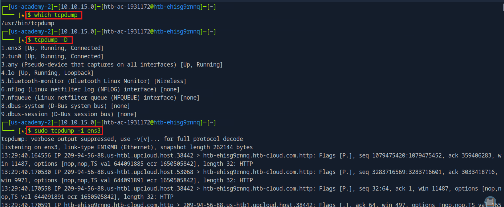
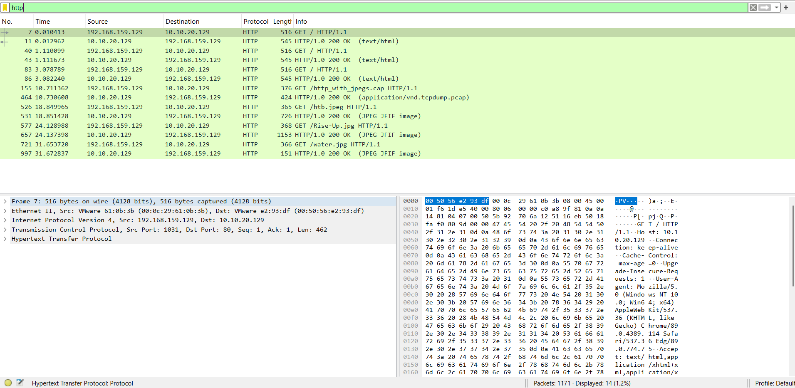
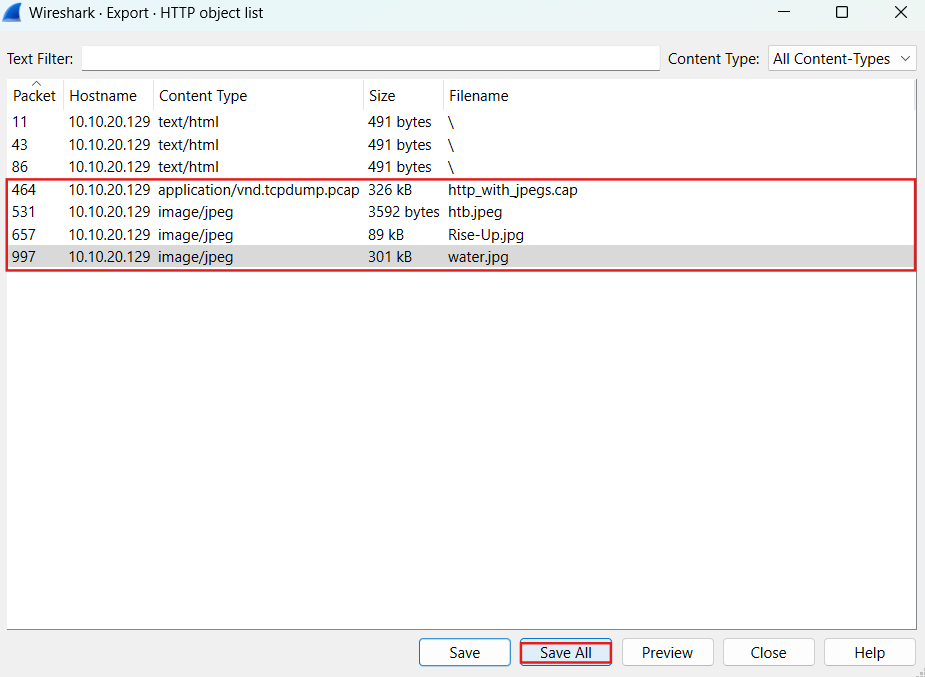

# Network Traffic Analysis and Threat Detection

## Project Overview
This project documents my hands-on journey through the Network Traffic Analysis module on Hack The Box Academy. It introduced me to real-world principles and techniques used by both offensive and defensive cybersecurity practitioners to analyze, filter, and interpret network traffic. Through a series of guided and unguided labs, I practiced using Wireshark and tcpdump to detect suspicious behavior, extract indicators of compromise (IOCs), and reconstruct attacker behavior from captured data

---
Module Scope

This HTB module provides foundational knowledge of network traffic analysis. It teaches defenders how to inspect historical and live network activity to identify vulnerabilities and signs of compromise. I learned:

- Core traffic analysis principles
- Tcpdump fundamentals for CLI-based inspection
- Practical Wireshark filtering and protocol analysis

The module is rated Medium and assumes comfort with Linux, networking, and basic security operations.

---

## Objectives
- Load and filter PCAP files using Wireshark and tcpdump
- Identify DNS tunneling and suspicious TCP sessions
- Extract meaningful metadata and IOCs
- Reconstruct attacker behavior from traffic logs
- Apply best practices for SOC-level investigations

---

## Tools & Technologies
- Platform: Hack The Box Academy
- Tools Used: Wireshark, tcpdump
- Protocols Observed: HTTP, DNS, FTP, TCP, RDP
- Environment: Simulated enterprise network (via Pwnbox/VM)
- File Types: .pcap, .txt, .png
  
---

## Steps Taken

**Opened PCAP in WireShark**

1. Opened PCAP in WiresharkApplied filters like tcp, rdp, !udp && !arp to isolate relevant traffic and uncover DNS tunneling patterns.

**Used tcpdump for CLI based Filtering**

2. Used tcpdump for CLI-Based FilteringVerified anomalies seen in Wireshark by reviewing packet flows with tcpdump. Focused on suspicious ports and IPs.

**Extracted Indicators of Compromise (IOC's)**

3. Extracted Indicators of Compromise (IOCs)Logged malicious IPs, unusual domains, file paths, and user actions. Matched activity to common attacker TTPs.

**Reconstructed behavior via Stream Analysis**

4. Reconstructed Behavior via Stream AnalysisFollowed TCP streams to view plaintext RDP or FTP activity and validated potential backdoors or data exfiltration attempts.

---

## Key Skills & Learnings

- Efficient use of Wireshark filters to reduce noise and target anomalies
- Used tcpdump to inspect traffic on the command line
- Practiced following sessions and reassembling payloads
- Developed an IOC extraction and reporting process for SOC readiness

---
 ## > All visuals stored in `screenshots/` subfolder

   
<strong>Key Visuals (click to expand)</strong> 

### Starting a TCPDump Capture

### Wireshark HTTP Filter Results

### Exporting HTTP objects

---

## Documentation
- [Network Traffic Analysis](docs/)
- [Visual walkthrough of key steps](screenshots/)

---

## Result

Completed the full HTB module and related labs with successful identification of malicious behavior and reconstructed attack patterns. Demonstrated foundational network forensics and packet inspection skills used by Tier 1 SOC Analysts and Incident Responders.

---

## Let’s Connect
I’m actively seeking IT Support or SOC Analyst roles in New York City or remote/hybrid environments. Let’s connect!

**Email**: jovaan.jwhitton@gmail.com  
**LinkedIn**: [linkedin.com/in/jovaan-whitton-profile](https://linkedin.com/in/jovaan-whitton-profile)

